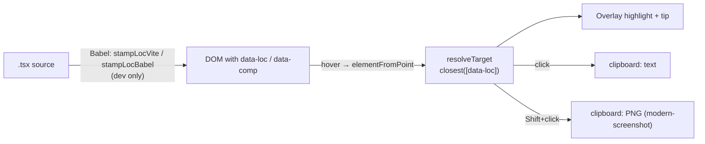

# semantic-inspector

[](https://www.npmjs.com/package/semantic-inspector)
[](https://github.com/ghost-vk/semantic-inspector/actions/workflows/ci.yml)
[](./LICENSE)

A dev-only React inspector for vibe-coding. Hit a hotkey to enter inspect mode: hovering highlights
the element under the cursor and shows its component name + `file:line:col`. **Click** copies that
text identifier to the clipboard; **Shift+click** copies a PNG screenshot of just that element.
Built for pasting precise UI context into an AI chat in seconds.

Stack: Vite + `@vitejs/plugin-react` + React 18/19. Designed to add **no production runtime cost
when you gate and lazy-load it** (see [Mount it](#2-mount-it-behind-your-own-dev-flag-ideally-lazy)) —
`modern-screenshot` is loaded lazily and the source-stamping plugin runs only on the dev server.

## Demo

[](https://github.com/ghost-vk/semantic-inspector/blob/main/docs/demo.mp4)

_Click for the full-resolution video._

## Install

```sh
npm i -D semantic-inspector
```

Peer dependencies:

- `react` / `react-dom` (`>=18`) — required.
- `vite` (`>=5`) — optional, only for `semantic-inspector/vite`.
- `@babel/core` (`>=7.25`) — optional, only for `semantic-inspector/vite` or
  `semantic-inspector/babel`. Most Vite + React projects already have it; if not:
  ```sh
  npm i -D @babel/core
  ```
  Pure-runtime consumers (`<SemanticInspector/>` only) don't need it.

## How it works

Source locations come from a **build-time stamp**, not React internals. A Babel pass adds
`data-loc="<path>:<line>:<col>"` and `data-comp="<Component>"` to JSX host elements (`div`,
`section`, …). The runtime reads those DOM attributes, so it stays robust across React versions. If
a node isn't stamped (prod build, foreign node), it degrades gracefully: fiber `displayName` →
filename → tag name.



## Semantic payload (opt-in)

By default a click copies one line: `Component — file:line:col`. Pass `semantic` to copy a
self-describing block instead — handy so an AI knows *which* element you meant without extra
explanation:

```tsx
<SemanticInspector semantic />
```

Clicking the "Рубрики" item then copies:

```
NavItem — src/components/Navigation/Sidebar.tsx:93:15
text: "Рубрики"
index: 2/5
path: App › Sidebar › NavItem
testid: nav-rubrics
```

Fields are added only when meaningful (e.g. `index` is dropped for a lone element). The visible
text is whitespace-collapsed and capped at 160 chars; the component path keeps the 4 nearest
`data-comp` ancestors; attributes are limited to `id`, `data-testid`, `name`, `href`, `type`.
Everything is read at click time, so hover stays cheap and the overlay tip is unchanged. A custom
`formatText` receives the full `SemanticInfo` object when `semantic` is on.

## Three entry points

| Import                     | What it is                                                          |
| -------------------------- | ------------------------------------------------------------------ |
| `semantic-inspector`       | `<SemanticInspector/>` + `useInspector()` — overlay/hotkey/clipboard runtime. |
| `semantic-inspector/vite`  | `stampLocVite()` — Vite plugin that stamps `data-loc` / `data-comp`. |
| `semantic-inspector/babel` | `{ stampLocBabel }` — raw Babel plugin, for the Babel variant of `@vitejs/plugin-react`. |

## Usage

### 1. Stamp source locations (Vite plugin)

`@vitejs/plugin-react` **v6** transpiles via oxc (no Babel hook), so stamp with a separate `pre`
plugin. **This is the recommended path.** The plugin runs only on the dev server (`apply: 'serve'`),
so `data-loc` / `data-comp` never reach a production build.

```ts
import react from '@vitejs/plugin-react';
import { stampLocVite } from 'semantic-inspector/vite';
import { defineConfig } from 'vite';

export default defineConfig({
  // stampLocVite first (enforce: 'pre'), then react()
  plugins: [stampLocVite({ rootDir: process.cwd() }), react()]
});
```

On the **Babel variant** of plugin-react you can skip the separate pre-pass by adding the plugin to
plugin-react's Babel options instead. Use **one** approach, not both. Note this forces plugin-react
onto Babel for all files (slower than the oxc + pre-pass above), so prefer option 1 unless you're
already on the Babel variant. Gate it to development so stamps stay out of production:

```ts
import react from '@vitejs/plugin-react';
import { stampLocBabel } from 'semantic-inspector/babel';

export default defineConfig(({ command }) => ({
  plugins: [
    react({
      babel: {
        plugins: command === 'serve' ? [[stampLocBabel, { rootDir: process.cwd() }]] : []
      }
    })
  ]
}));
```

### 2. Mount it (behind your own dev flag, ideally lazy)

```tsx
import { lazy, Suspense } from 'react';

const SemanticInspector = lazy(() =>
  import('semantic-inspector').then((m) => ({ default: m.SemanticInspector }))
);

{
  import.meta.env.DEV && (
    <Suspense fallback={null}>
      <SemanticInspector onCopy={(kind) => toast(`${kind} copied`)} />
    </Suspense>
  );
}
```

## API

### `<SemanticInspector>` props

| prop         | default                  | purpose                                   |
| ------------ | ------------------------ | ----------------------------------------- |
| `hotkey`     | `'Alt+Shift+S'`          | toggle inspect mode (Esc always exits)    |
| `semantic`   | `false`                  | enrich the copied text with visible label, sibling index, component path, and key attributes (see [Semantic payload](#semantic-payload-opt-in)) |
| `formatText` | `` `${comp} — ${loc}` `` | format of the text copied on click; receives `SemanticInfo` (the extra fields are populated only when `semantic` is on; `loc` may be `null`) |
| `onCopy`     | —                        | called after a successful copy            |
| `onError`    | —                        | called on a clipboard/screenshot failure  |

`useInspector(props)` is also exported for building a custom overlay; it returns
`{ active, target }`. Note: used raw (not via `<SemanticInspector>`), it has no default `onError`,
so failures only surface via `console.warn` unless you pass one.

#### Callback payloads

- `onCopy('text', payload)` — `payload` is the copied string.
- `onCopy('screenshot', payload)` — `payload` is the **component name** (the PNG goes to the
  clipboard, not to the callback).
- `onError(kind, err)` — `err` is the underlying error (`unknown`).

### Plugin options (`stampLocVite` / `stampLocBabel`)

| option     | default          | applies to   | purpose                                        |
| ---------- | ---------------- | ------------ | ---------------------------------------------- |
| `rootDir`  | `process.cwd()`  | both         | base for the relative path written into `data-loc` |
| `include`  | `/\.[jt]sx$/`    | `/vite` only | which module ids get stamped                   |
| `attrLoc`  | `'data-loc'`     | both         | attribute name for `path:line:col`             |
| `attrComp` | `'data-comp'`    | both         | attribute name for the component name          |

Files outside `rootDir` degrade to their basename, so an absolute filesystem path never leaks into
the stamped DOM.

## Hotkey format

`Modifier+...+Key`. Modifiers: `Alt`, `Shift`, `Ctrl` (or `Control`), `Meta` (or `Cmd`). The final
token is the key. Matching is case-insensitive and also matches the physical `event.code`, so
layout-shifted glyphs work (e.g. `Ctrl+Shift+/` matches even though Shift produces `?`). Digit and
punctuation keys are supported (`Alt+1`, `Ctrl+/`). `Esc` always exits inspect mode.

## Troubleshooting

| Symptom | Cause | Fix |
| --- | --- | --- |
| Nothing copies, no error | `navigator.clipboard` needs a secure context | Use `localhost` or `https://`, not `http://192.168.x.x` |
| Screenshot is blank/partial | CORS-tainted canvas / unsupported CSS | Serve images with CORS headers; some CSS (cross-origin ``, exotic filters) won't rasterize |
| `loc` shows `no source` / name is minified | Node wasn't stamped (prod build, or plugin not registered) | Register the stamper (Usage 1) and confirm it isn't gated out in dev |
| Hotkey does nothing | Focus is in an input, or a typo in the combo | Use a `Modifier+Key` combo (see above); try the default `Alt+Shift+S` |

## Browser support

Works in current Chromium, Edge, Firefox, and Safari. Image-clipboard (Shift+click screenshot)
requires a `ClipboardItem`-capable browser; text copy works everywhere with a secure context.

## Contributing

See [CONTRIBUTING.md](./CONTRIBUTING.md). In short: `npm ci`, then
`npm run lint && npm run typecheck && npm test && npm run build`. `dist/` is generated — build once
after cloning before `npm link`.

## License

[MIT](./LICENSE) © ghost-vk
