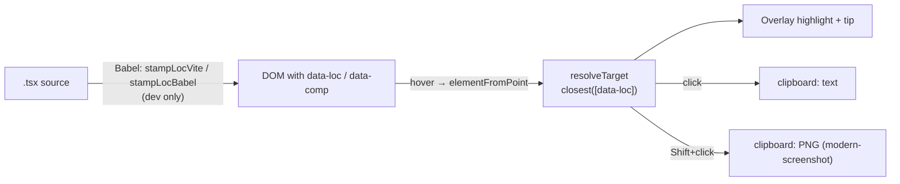

# semantic-inspector

[](https://www.npmjs.com/package/semantic-inspector)
[](https://github.com/ghost-vk/semantic-inspector/actions/workflows/ci.yml)
[](./LICENSE)

A dev-only React inspector for vibe-coding. Hit a hotkey to enter inspect mode: hovering highlights
the element under the cursor and shows its component name + `file:line:col`. **Click** copies that
text identifier to the clipboard; **Shift+click** copies a PNG screenshot of just that element.
Built for pasting precise UI context into an AI chat in seconds.

Stack: Vite + `@vitejs/plugin-react` + React 18/19. Designed to add **no production runtime cost
when you gate and lazy-load it** (see [Mount it](#2-mount-it-behind-your-own-dev-flag-ideally-lazy)) —
`modern-screenshot` is loaded lazily and the source-stamping plugin runs only on the dev server.

## Demo

[](https://github.com/ghost-vk/semantic-inspector/blob/main/docs/demo.mp4)

_Click for the full-resolution video._

**Try it locally:** `npm run dev:example` runs a playground app ([`examples/playground`](./examples/playground)) wired to the package source — inspect, screenshot, and annotate against a real page.

## Install

```sh
npm i -D semantic-inspector
```

Peer dependencies:

- `react` / `react-dom` (`>=18`) — required.
- `vite` (`>=5`) — optional, only for `semantic-inspector/vite`.
- `@babel/core` (`>=7.25`) — optional, needed for `semantic-inspector/vite`,
  `semantic-inspector/babel`, **and the `semantic-inspector check` drift CLI** (it parses your
  source with Babel). Most Vite + React projects already have it; if not:
  ```sh
  npm i -D @babel/core
  ```
  Pure-runtime consumers (`<SemanticInspector/>` only) don't need it.

## How it works

Source locations come from a **build-time stamp**, not React internals. A Babel pass adds
`data-loc="<path>:<line>:<col>"` and `data-comp="<Component>"` to JSX host elements (`div`,
`section`, …). The runtime reads those DOM attributes, so it stays robust across React versions. If
a node isn't stamped (prod build, foreign node), it degrades gracefully: fiber `displayName` →
filename → tag name.



## Semantic payload (opt-in)

By default a click copies one line: `Component — file:line:col`. Pass `semantic` to copy a
self-describing block instead — handy so an AI knows *which* element you meant without extra
explanation:

```tsx
<SemanticInspector semantic />
```

Clicking the "Рубрики" item then copies:

```
NavItem — src/components/Navigation/Sidebar.tsx:93:15
text: "Рубрики"
index: 2/5
path: App › Sidebar › NavItem
testid: nav-rubrics
```

Fields are added only when meaningful (e.g. `index` is dropped for a lone element). The visible
text is whitespace-collapsed and capped at 160 chars; the component path keeps the 4 nearest
`data-comp` ancestors; attributes are limited to `id`, `data-testid`, `name`, `href`, `type`.
Everything is read at click time, so hover stays cheap and the overlay tip is unchanged. A custom
`formatText` receives the full `SemanticInfo` object when `semantic` is on.

> **Note:** the block includes the element's visible text and its `href`, and the whole thing is
> meant to be pasted into an AI chat. Avoid `semantic` on screens showing secrets or PII (tokens in
> URLs, personal data in labels) — or strip those fields with a custom `formatText`.

## Annotate mode (opt-in)

Beyond copying a pointer, you can give an element a durable, human-friendly name so you and an AI
share the same vocabulary later — without re-inspecting. Enable it and press the annotate hotkey
(default `Alt+Shift+A`) to enter annotate mode; click an element to open an inline editor for a
**name** (+ optional **tags** and a **note**):

```tsx
<SemanticInspector annotate onAnnotate={(a) => toast(`saved ${a.name}`)} />
```

Saving POSTs to a dev-server endpoint that the Vite plugin adds (`configureServer`, dev only) and
writes two files at your project root:

- `.semantic-inspector/annotations.json` — source of truth (upserted by name).
- `.semantic-inspector/annotations.md` — a regenerated, human/Graphify-readable mirror.

Each annotation is anchored on a **durable descriptor** — the same signals as the semantic payload
(component, visible text, sibling index, component path, and stable attributes such as
`data-testid`) — not on `file:line:col`. The line/file is kept only as a `lastSeen` hint. So when an
AI later needs "the пилюля," it reads the file and re-finds the element by grepping the stable
signals (testid → id → visible text + component), which survive refactors far better than a line
number.

Commit `.semantic-inspector/` to share the vocabulary with your team and your AI.

> **Note (privacy):** annotations store the element's visible text, your note, and stable attributes
> (including `href`) in a repo file. Avoid annotating elements whose text/URL contains secrets or
> PII, and review `.semantic-inspector/annotations.json` before committing.

> **Note (security):** the annotate endpoint is an **unauthenticated POST that writes into your
> working tree**, mounted only on the Vite dev server. It requires `Content-Type: application/json`
> and rejects cross-origin requests (so a random page you visit can't drive-by-write your repo), but
> keep the dev server on `localhost` and don't expose it on an untrusted network (`--host`). The
> endpoint never exists in a production build.

> **Note (AI trust boundary):** `annotations.md` is fed to an AI (Graphify) and committed, yet its
> field values (`name`, `note`, `text`, attributes) are untrusted free text. The mirror escapes
> Markdown and flags the values as untrusted, but that cannot stop *semantic* prompt injection —
> review entries before feeding the mirror to an automated agent, exactly as you would any other
> repo text an AI ingests.

### How an AI resolves a name

Given a name (e.g. "пилюля"): read `.semantic-inspector/annotations.json`, find the entry, then grep
the live code in decreasing order of stability — `data-testid` → `id`/`name`/`href` → visible
`text` near the `data-comp`. Treat `lastSeen.loc` as a first guess only; verify it.

## Drift detection (CI)

Annotations anchor on durable signals, but code still changes. `semantic-inspector check` re-resolves
every entry in `.semantic-inspector/annotations.json` against your current source (static Babel
analysis — no browser, no build) and reports drift, so CI can block a merge until the graph is
updated, and an AI agent can re-anchor what moved.

```bash
npx semantic-inspector check            # human table, exits 1 on drift
npx semantic-inspector check --json     # machine report for an AI agent
npx semantic-inspector check --fix      # relock entries that moved to a new, unique location
```

Each annotation gets a verdict:

| verdict | meaning | CI (default) | `--fix` |
| --- | --- | --- | --- |
| `resolved` | found at the recorded location | pass | relocks if the stored loc is stale/absent ¹ |
| `moved` | found, but at a new location (stale `lastSeen.loc`) | **fail** | relocks it |
| `missing` | no matching element — deleted or renamed | **fail** | re-anchor by hand/AI |
| `ambiguous` | several equally-good matches | **fail** | disambiguate by hand/AI |
| `unverifiable` | no statically-resolvable signal (all signals are dynamic in source) | pass (warn) | add any static signal ² |

¹ **What `--fix` actually relocks:** every entry whose anchor resolves to a single location that
differs from the stored `lastSeen.loc` — that is each `moved` entry, **and** a freshly-anchored entry
whose `lastSeen.loc` was never stamped (verdict `resolved`, old loc `null`). The anchor itself is
never changed; only `lastSeen` + `updatedAt` are. So `--fix` can write to the store **even when the
headline reads `0 drifted`** (relocking a newly-found, previously-unstamped entry).

² **What makes an element verifiable:** any one of `data-testid`, `id`, `name`, `href`, or literal
element text is enough to resolve it statically — `data-testid` is simply the highest-weighted
signal, not a requirement. Only elements whose every signal is dynamic in source (e.g. `href={url}`,
`{interpolatedText}` with no stable attribute) come back `unverifiable`.

Flags: `--root <dir>` (default cwd), `--include <prefix>` (repeatable scan filter), `--allow-moved`
(moved → warning), `--strict` (unverifiable → failure), `--json` (machine report), `--fix` (relock),
`--help`, `--version`. Exit codes: **0** = clean, **1** = drift (something to fix), **2** = error
(bad args, unreadable/malformed `annotations.json`). Requires `@babel/core` (already present if you
use the Vite/Babel stamp).

### What is scanned

The check walks the tree under `--root` and parses every `.ts` / `.tsx` / `.js` / `.jsx` file,
**skipping**: `node_modules/`, `dist/`, any dotdir (`.git`, `.semantic-inspector`, …), test files
(`*.test.*`), and `*.d.ts`. `--include <prefix>` (repeatable) narrows the scan to paths under one or
more prefixes (e.g. `--include src/components`). A file larger than ~2 MB is **skipped** (Babel would
risk an out-of-memory crash on it) and counted in `skipped`; a file that fails to parse is likewise
skipped + counted. When `skipped > 0` the scan was partial, so treat a `missing` verdict with caution
— the human report prints a warning line and the JSON report carries the count.

> If an annotated element lives in a skipped location (a test file, a dotdir, an excluded prefix), it
> will report `missing` even though it exists. Add its directory to the scan with `--include`, or
> move the element out of an ignored path.

### Machine report (`--json`)

`--json` is the **AI-agent contract**: a stable, machine-readable snapshot an agent reads to re-anchor
the graph. Shape:

```jsonc
{
  "drifted": 1,        // count of moved + missing + ambiguous (resolved + unverifiable excluded)
  "ok": 2,             // count of resolved entries
  "skipped": 0,        // source files not analyzed (too large / parse error); > 0 ⇒ partial scan
  "entries": [
    {
      "name": "save-button",          // the annotation name (key in annotations.json)
      "verdict": "moved",             // "resolved" | "moved" | "missing" | "ambiguous" | "unverifiable"
      "lastSeenLoc": "src/Form.tsx:12:5",  // stored loc snapshot, or null when never stamped
      "resolvedLoc": "src/Form.tsx:40:5",  // where it resolves now: same as lastSeenLoc when resolved,
                                            // the new loc when moved, else null (missing/ambiguous)
      "candidates": [                  // ranked matches, score desc then loc asc
        { "loc": "src/Form.tsx:40:5", "score": 100 }
      ]
    }
  ]
}
```

Field stability: the top-level keys (`drifted`, `ok`, `skipped`, `entries`) and the per-entry keys are
covered by semver — additive changes only within a major. `score` weights are an internal heuristic
and may change between minors; rank order (best first) is the stable signal, not the absolute number.

**Agent recipe:** run `semantic-inspector check --json`; for each `entry` where `verdict === "moved"`,
the fix is `resolvedLoc` (apply with `--fix`); for `missing` / `ambiguous`, read `candidates` and the
source to re-anchor by hand; ignore `resolved` / `unverifiable`; if `skipped > 0`, the scan was
partial — don't trust `missing` without widening the scan.

### Example CI step

Fail the job on drift; an agent then reads `--json`, relocks (`--fix`) or re-anchors, and re-runs to
green:

```yaml
jobs:
  drift:
    runs-on: ubuntu-latest
    steps:
      - uses: actions/checkout@v4
      - uses: actions/setup-node@v4
        with:
          node-version: 20
      - run: npm ci
      - run: npx semantic-inspector check   # exit 1 on drift blocks the merge
```

`npm ci` is what makes `@babel/core` available to the check; if it isn't a (transitive) dependency,
add `npm i -D @babel/core` or install it as a dedicated CI step.

## Entry points

Three import surfaces plus one executable:

| Surface                    | What it is                                                          |
| -------------------------- | ------------------------------------------------------------------ |
| `semantic-inspector`       | `<SemanticInspector/>` + `useInspector()` — overlay/hotkey/clipboard runtime. |
| `semantic-inspector/vite`  | `stampLocVite()` — Vite plugin that stamps `data-loc` / `data-comp`. |
| `semantic-inspector/babel` | `{ stampLocBabel }` — raw Babel plugin, for the Babel variant of `@vitejs/plugin-react`. |
| `semantic-inspector` (bin) | the `check` drift CLI — `npx semantic-inspector check` (see [Drift detection](#drift-detection-ci)). |

The import surfaces are browser/dev-server code; the `check` bin is **node-only** (it reads the
filesystem and parses with Babel) and never enters the browser bundle.

## Usage

### 1. Stamp source locations (Vite plugin)

`@vitejs/plugin-react` **v6** transpiles via oxc (no Babel hook), so stamp with a separate `pre`
plugin. **This is the recommended path.** The plugin runs only on the dev server (`apply: 'serve'`),
so `data-loc` / `data-comp` never reach a production build.

```ts
import react from '@vitejs/plugin-react';
import { stampLocVite } from 'semantic-inspector/vite';
import { defineConfig } from 'vite';

export default defineConfig({
  // stampLocVite first (enforce: 'pre'), then react()
  plugins: [stampLocVite({ rootDir: process.cwd() }), react()]
});
```

On the **Babel variant** of plugin-react you can skip the separate pre-pass by adding the plugin to
plugin-react's Babel options instead. Use **one** approach, not both. Note this forces plugin-react
onto Babel for all files (slower than the oxc + pre-pass above), so prefer option 1 unless you're
already on the Babel variant. Gate it to development so stamps stay out of production:

```ts
import react from '@vitejs/plugin-react';
import { stampLocBabel } from 'semantic-inspector/babel';

export default defineConfig(({ command }) => ({
  plugins: [
    react({
      babel: {
        plugins: command === 'serve' ? [[stampLocBabel, { rootDir: process.cwd() }]] : []
      }
    })
  ]
}));
```

### 2. Mount it (behind your own dev flag, ideally lazy)

```tsx
import { lazy, Suspense } from 'react';

const SemanticInspector = lazy(() =>
  import('semantic-inspector').then((m) => ({ default: m.SemanticInspector }))
);

{
  import.meta.env.DEV && (
    <Suspense fallback={null}>
      <SemanticInspector onCopy={(kind) => toast(`${kind} copied`)} />
    </Suspense>
  );
}
```

## API

### `<SemanticInspector>` props

| prop         | default                  | purpose                                   |
| ------------ | ------------------------ | ----------------------------------------- |
| `hotkey`     | `'Alt+Shift+S'`          | toggle inspect mode (Esc always exits)    |
| `semantic`   | `false`                  | enrich the copied text with visible label, sibling index, component path, and key attributes (see [Semantic payload](#semantic-payload-opt-in)) |
| `annotate`   | `false`                  | enable annotate mode: a hotkey opens an inline editor to name an element; the annotation is persisted to `.semantic-inspector/` via the dev plugin (see [Annotate mode](#annotate-mode-opt-in)) |
| `annotateHotkey` | `'Alt+Shift+A'`      | hotkey that toggles annotate mode |
| `annotateEndpoint` | `'/__semantic_inspector/annotations'` | override the POST endpoint path |
| `onAnnotate` | —                        | called with the saved annotation after a successful save |
| `formatText` | `` `${comp} — ${loc}` `` | format of the text copied on click; receives `SemanticInfo` (the extra fields are populated only when `semantic` is on; `loc` may be `null`) |
| `onCopy`     | —                        | called after a successful copy            |
| `onError`    | —                        | called on a clipboard/screenshot failure  |

`useInspector(props)` is also exported for building a custom overlay; it returns
`{ active, mode, target, draft, closeDraft }` — `mode` is `'off' | 'inspect' | 'annotate'`, `draft`
is non-null while the annotation editor should be open (with the captured `anchor`/`lastSeen`), and
`closeDraft()` dismisses it. `active` is kept as a back-compat alias for `mode !== 'off'`. Note: used
raw (not via `<SemanticInspector>`), it has no default `onError`, so failures only surface via
`console.warn` unless you pass one.

#### Callback payloads

- `onCopy('text', payload)` — `payload` is the copied string.
- `onCopy('screenshot', payload)` — `payload` is the **component name** (the PNG goes to the
  clipboard, not to the callback).
- `onError(kind, err)` — `err` is the underlying error (`unknown`).

### Plugin options (`stampLocVite` / `stampLocBabel`)

| option     | default          | applies to   | purpose                                        |
| ---------- | ---------------- | ------------ | ---------------------------------------------- |
| `rootDir`  | `process.cwd()`  | both         | base for the relative path written into `data-loc` |
| `include`  | `/\.[jt]sx$/`    | `/vite` only | which module ids get stamped                   |
| `annotateEndpoint` | `'/__semantic_inspector/annotations'` | `/vite` only | path the annotate middleware listens on; must match the `<SemanticInspector annotateEndpoint>` prop |
| `attrLoc`  | `'data-loc'`     | both         | attribute name for `path:line:col`             |
| `attrComp` | `'data-comp'`    | both         | attribute name for the component name          |

Files outside `rootDir` degrade to their basename, so an absolute filesystem path never leaks into
the stamped DOM.

## Hotkey format

`Modifier+...+Key`. Modifiers: `Alt`, `Shift`, `Ctrl` (or `Control`), `Meta` (or `Cmd`). The final
token is the key. Matching is case-insensitive and also matches the physical `event.code`, so
layout-shifted glyphs work (e.g. `Ctrl+Shift+/` matches even though Shift produces `?`). Digit and
punctuation keys are supported (`Alt+1`, `Ctrl+/`). `Esc` always exits inspect mode.

## Troubleshooting

| Symptom | Cause | Fix |
| --- | --- | --- |
| Nothing copies, no error | `navigator.clipboard` needs a secure context | Use `localhost` or `https://`, not `http://192.168.x.x` |
| Screenshot is blank/partial | CORS-tainted canvas / unsupported CSS | Serve images with CORS headers; some CSS (cross-origin ``, exotic filters) won't rasterize |
| `loc` shows `no source` / name is minified | Node wasn't stamped (prod build, or plugin not registered) | Register the stamper (Usage 1) and confirm it isn't gated out in dev |
| Hotkey does nothing | Focus is in an input, or a typo in the combo | Use a `Modifier+Key` combo (see above); try the default `Alt+Shift+S` |

## Browser support

Works in current Chromium, Edge, Firefox, and Safari. Image-clipboard (Shift+click screenshot)
requires a `ClipboardItem`-capable browser; text copy works everywhere with a secure context.

## Contributing

See [CONTRIBUTING.md](./CONTRIBUTING.md). In short: `npm ci`, then
`npm run lint && npm run typecheck && npm test && npm run build`. `dist/` is generated — build once
after cloning before `npm link`.

## License

[MIT](./LICENSE) © ghost-vk
